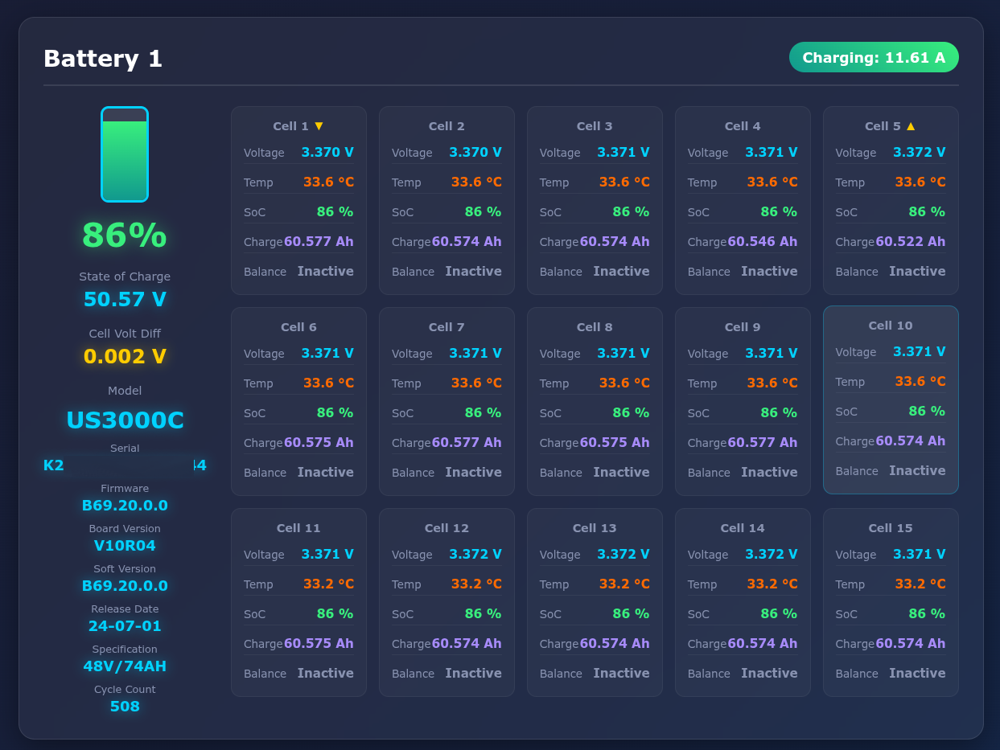

# Pylontech Battery Monitor

The Pylontech Battery Monitor is connected via a serial connection to the "Console" port of the master battery. It automatically detects the number of installed batteries and reads their values. The battery information is storaged and displayed on a local webpage and is also published to an MQTT broker. A setup page is used for MQTT configuration.

## Supported Hardware:
Raspberry PI: recommended for lowest power consumption is the Raspberry PI Zero W,
but any other SBC is also compatible.

## Supported Serial Ports:
You can use internal Raspberry's Serial Port and a external Serial port (PL2303 / Cisco Serial Cable with adaptor).

## Connection:
Connect the Console connector of the master battery to the primary serial interface.

## Install required libraries:
Run the script named `prepare` to install necessary libraries.

## Build the software:
make clean 
make 
This process will create the executable file named `pylonmonitor`.

## Install Autorun Service:
Run the script named `install` to install autorun service.

## Run manually the software:
If you need run manually:
 * First you need stop autorun service: sudo systemctl stop pylonmonitor.service
 * Now you can run software with root privileges by executing `sudo ./pylonmonitor`.

## Number of Pylontech Batteries:
The software automatically detects the number of connected Pylontech batteries.

## Using the pylontech battery monitor:
1. via Web interface: Access the Raspberry Pi's IP address in a web browser. 
2. Click on "SETUP" in the top of the web interface to configure network settings and MQTT. 
3. Use tools like MQTT Explorer to verify that everything is working as expected

## Web Interface:

